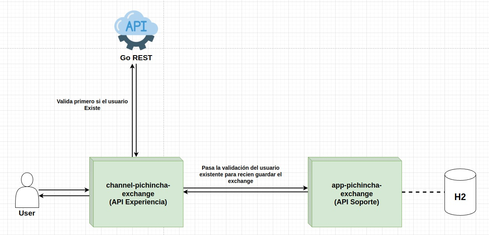

# Proyecto de Exchange Service

## Descripción
Este proyecto implementa una API para la gestión de transacciones de cambio de divisas. Los usuarios pueden crear, actualizar y consultar transacciones de intercambio, con autenticación mediante token de GoRest.

## Características
- **Autenticación**: Autenticación mediante tokens de tipo Bearer JWT.
- **Operaciones**:
    - Crear una transacción de intercambio.
    - Actualizar una transacción existente.
    - Buscar una transacción por ID.
    - Listar todas las transacciones de un usuario.

## Endpoints

### 1. Crear una nueva transacción
**POST /exchange**

### 2. Actualizar una transacción
**PATCH /exchange/{id}**

### 3. Obtener una transacción por ID
**GET /exchange/{id}**

### 4. Listar las transacciones de un usuario
**GET /exchange/user**

## Arquitectura

A continuación se muestra la arquitectura de la solución:



## Requisitos
- Java 17
- Spring Boot 3.0.0
- WebFlux
- GoRest token para autenticación

## Instalación

1. Clonar el repositorio:
   ```bash
   git clone https://github.com/tuusuario/tu-repositorio.git
